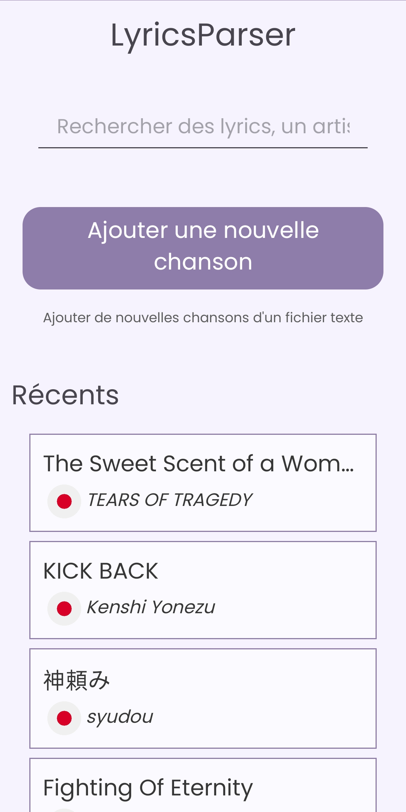
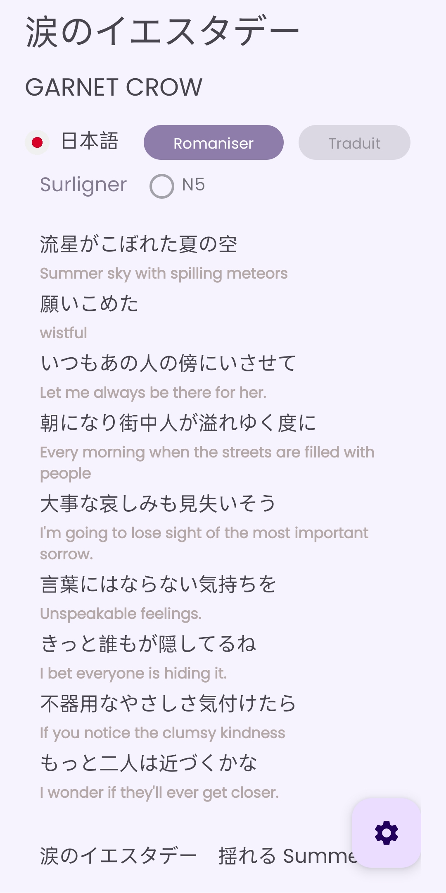
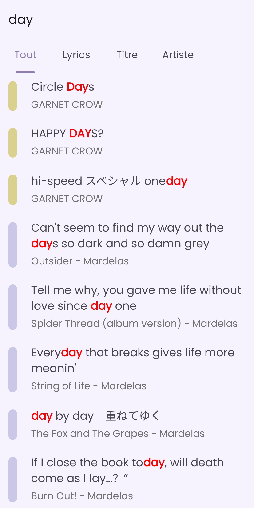
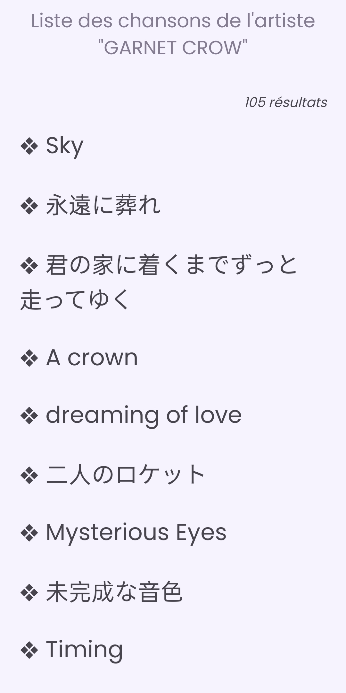

# LyricsParser

Application de visualisation de paroles de chanson.

## Technologies utilisées

- Java (Android SDK)
- Côté serveur : PHP + Python

## Dépendances

- Java 17
- Python 3.10.12
- PHP 8.4.12
- Clé d'API DeepL

## Fonctionnalités de l'application

- Création de fiches de paroles de chanson manuelle dans l'application ou via l'upload d'un fichier texte
- Visualisation des paroles
- Edition ou suppression de fiches de paroles
- Traduction et "romanisation" des paroles (japonais uniquement)
- Recherche par terme de titre, paroles ou artiste
- Affichage des titres d'un même artiste
- Affichage des 5 ajouts les plus récents dans la page d'accueil

## Comment configurer l'application

- Coté serveur :
  - déplacer les fichiers du dossier `server` dans un serveur Web (ex : Apache HTTP Server)
  - modifier le fichier [`config.properties`](android-app/config.properties) avec l'addresse du dossier contenant ces mêmes fichiers (ex: `https://0.0.0.0/LyricsParser`)
  - modifier le fichier [`deepl`](server/deepl) avec votre clé d'API générée sur le site de [DeepL](https://www.deepl.com/fr/translator)

- Coté application : ouvrir le dossier `android-app` dans Android Studio puis exécuter

## Captures d'écran de l'application

La totalité des captures d'écran se situent dans le dossier [`pics`](pics/).

  
  
  
  

