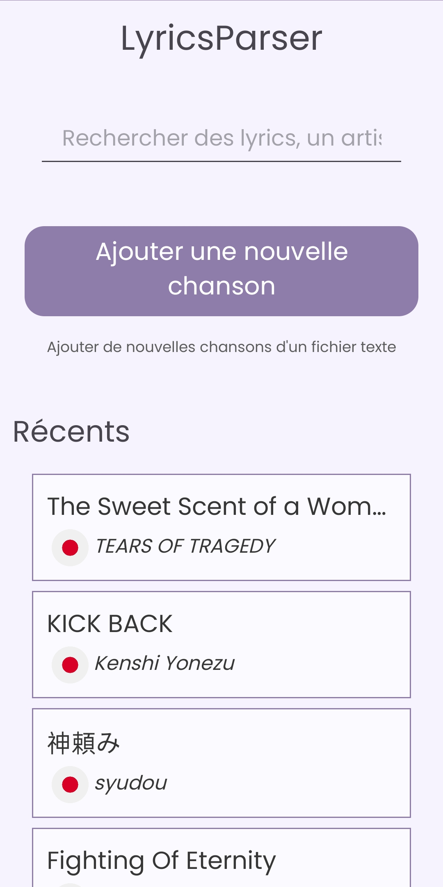
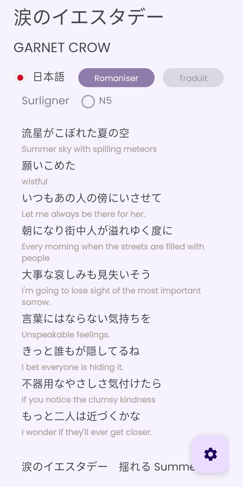
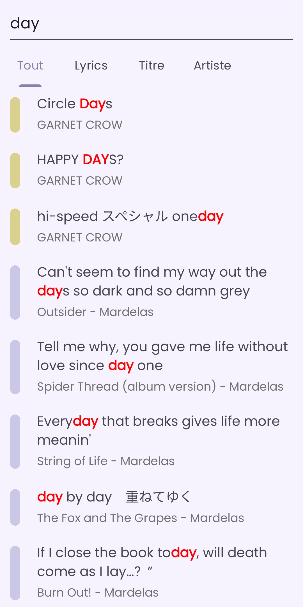
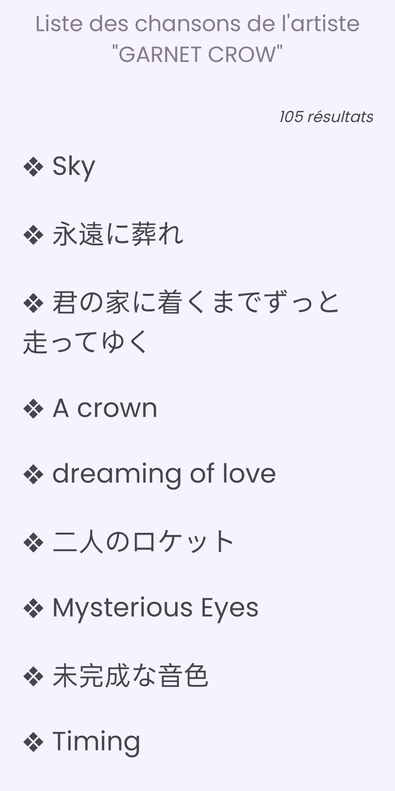

# LyricsParser

Application de visualisation de paroles de chanson multilingue.

## Technologies utilisées

- Java (Android SDK)
- Côté serveur (API) : Python (FastAPI)

## Dépendances

- Java >= 17
- Python >= 3.12
- Clé d'API DeepL

## Fonctionnalités de l'application

- Création de fiches de paroles de chanson manuelle dans l'application ou via l'upload d'un fichier texte
- Visualisation des paroles
- Edition ou suppression de fiches de paroles
- Traduction et "romanisation" des paroles (japonais uniquement)
- Recherche par terme de titre, paroles ou artiste
- Affichage des titres d'un même artiste
- Affichage des 5 ajouts les plus récents dans la page d'accueil

## Comment configurer l'application

### Coté serveur (FastAPI)

1. Installer les dépendances Python

    Créer un environnement virtuel et installer les dépendances du fichier `requirements.txt`

    ```sh
    python3.12 -m venv venv
    source venv/bin/activate
    pip install -r requirements.txt
    ```

2. Configurer la clé DeepL

    Modifier le fichier [`api/data/deepl`](api/data/deepl) avec votre clé d'API générée sur le site de [DeepL](https://www.deepl.com/fr/translator)

3. Lancer l’API FastAPI

    ```sh
    uvicorn main:app --host 0.0.0.0 --port 8000
    ```

    L’API sera accessible à l’adresse :

    ```txt
    http://[IP_SERVEUR]:8000
    ```

### Coté application Android

1. Configurer l'addresse du serveur

    Modifier le fichier [`android-app/config.properties`](android-app/config.properties) avec l'addresse de votre serveur

    ```txt
    // exemple
    SERVER_ADDRESS=http://[IP_SERVEUR]:8000
    ```

2. Ouverture et exécution

    Ouvrir le dossier `android-app/` dans Android Studio puis exécuter l'application

## Ajouter de nouvelles chansons via un fichier ".txt"

Un fichier [`lyrics.txt`](lyrics.txt) contenant 21 fiches de paroles est fourni dans le dépot.

Pour insérer ces fiches dans l'application, cliquer sur le bouton-texte `Ajouter de nouvelles chansons d'un fichier texte` (voir section suivante) de la page d'accueil.

Ensuite, sélectionner le fichier depuis votre téléphone puis cliquer sur "Ajouter".

## Captures d'écran de l'application

La totalité des captures d'écran se situent dans le dossier [`pics/`](pics/).

<div style="display: flex; flex-wrap: wrap; gap: 10px;">
  
  
  
  
</div>
